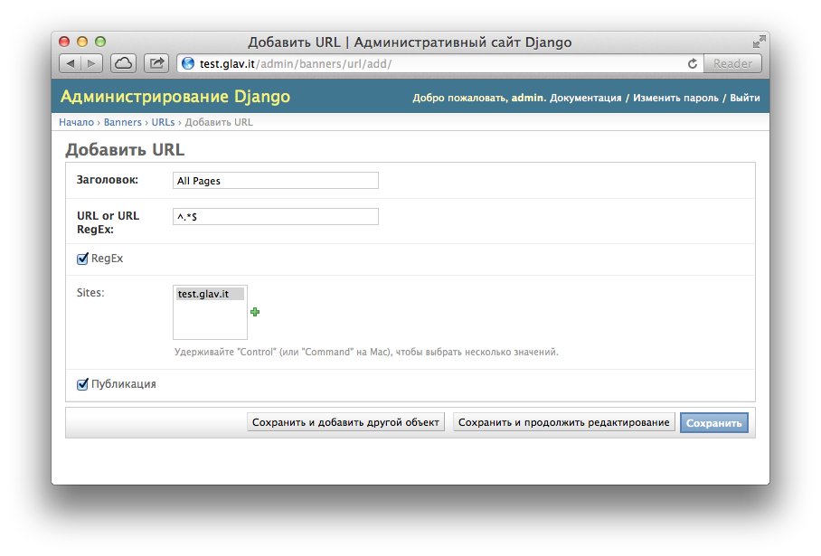
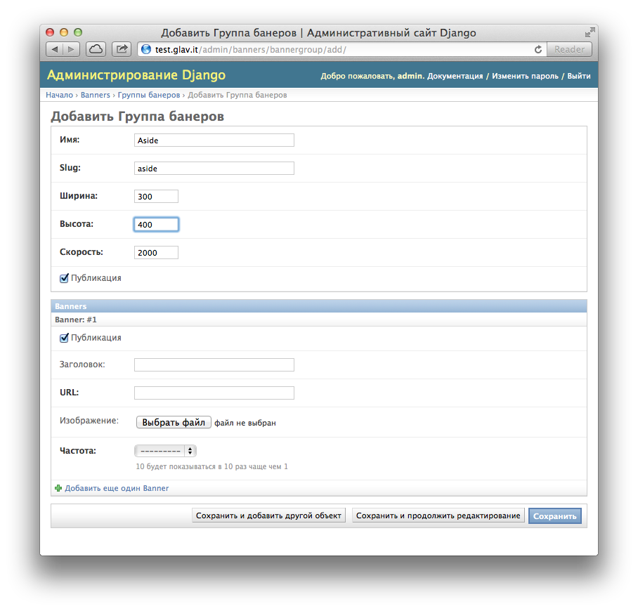
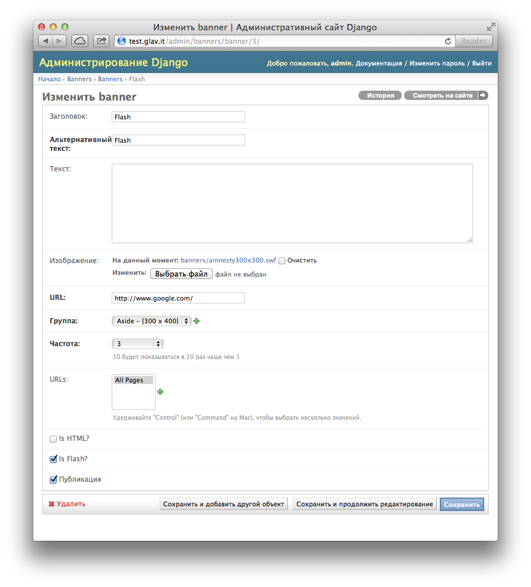
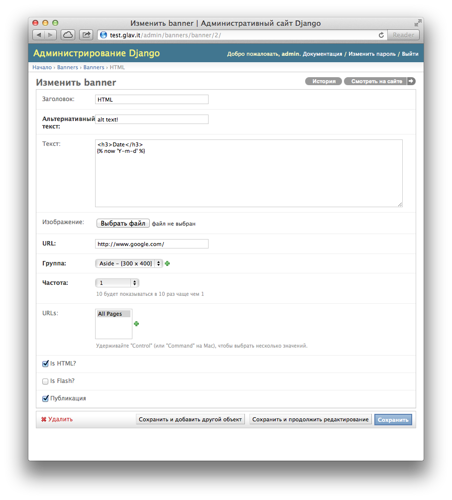

Руководство пользователя
========================

Создание URL
------------

В первую очередь нужно создать URL на которых будут показываться баннеры.

В примере ниже показанно создание URL на основе регулярного выражения для всех страниц домена test.glav.it.

   
   Добавление URL

Создание групп
--------------

При создании группы указываются следующие параметры:

* **Имя**
   | Определяет имя группы в списке
* **Slug**
   | Определяет ярлык для доступа через тег
* **Ширина**
   | Ширина группы баннеров
* **Высота**
   | Высота группы баннеров
* **Скорость**
   | Скорость ротации баннеров
* **Публикация**
   | Определяет показываются ли баннеры из данной группы

   
   Добавление группы

Создание баннеров
-----------------

При создании баннера указываются следующие параметры:

* **Заголовок**
   | Заголовок баннера
* **Альтернативный текст**
   | Альтернативный текст для изображения
* **Текст**
   | Сопроводительный текст, или HTML для рендинга
* **Изображение**
   | Изображение или флеш файл
* **URL**
   | Ссылка для перехода при клике по баннеру
* **Группа**
   | Группа баннеров
* **Частота**
   | Насколько часто показывается баннер относительно других
* **URLs**
   | URL на которых показывается баннер
* **Is HTML?**
   | Является ли баннер HTML
* **Is Flash?**
   | Является ли баннер Flash баннером
* **Публикация**
   | Будет ли баннер показывается

   
   Добавление простого баннера

   
   Добавление HTML баннера

   
   Добавление Flash баннера

Вывод баннеров
--------------

Для вывода одного баннеров необходимо сначала загрузить шаблонные теги ``banner``.

.. code-block:: django

   

Вывод одного баннера
^^^^^^^^^^^^^^^^^^^^

Один баннер выводится при помощи шаблонного тега ``banner_one`` он принимает на вход 1 обязательный параметр, ID баннера для показа. Второй необязательный параметр это шаблон вывода баннера, по умолчанию это файл ``banner.html``.

.. code-block:: django

   
   

Вывод группы баннеров
^^^^^^^^^^^^^^^^^^^^^

Группа баннеров выводится при помощи шаблонного тега ``banner_group`` он принимает на вход 1 обязательный параметр, Slug группы баннеров. Второй необязательный параметр это шаблон вывода группы баннеров, по умолчанию это файл ``group.html``.

.. code-block:: django

   
   
